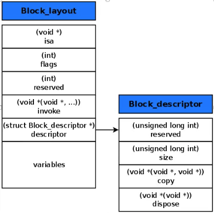
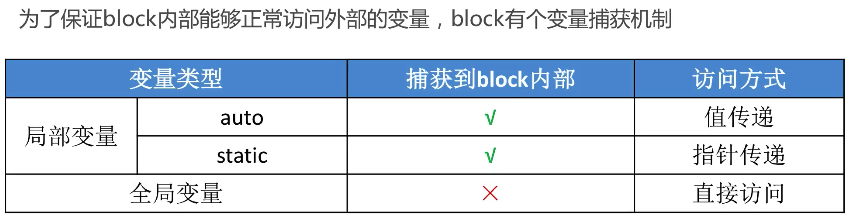
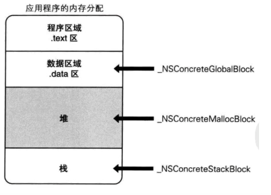
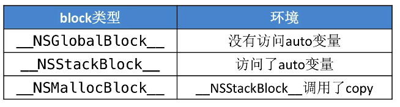
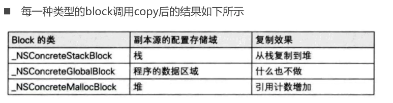
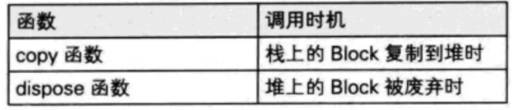

# Block
### Block定义及本质</br>
block本质上也是一个**OC对象**,它内部有个isa指针(有isa指针就可以认为是OC对象)</br>
block是**封装了函数调用以及函数调用环境的OC对象**</br>
>函数调用环境:函数调用所需要的参数及外部参数等

```objc
int age = 20;
void (^Block)() = ^{
  NSLog(@"age = %d",age);
}
```

Block的内部结构

```objc
//以上block的内部结构
struct __main_block_impl_0 {
  struct __block_impl impl;
  struct __main_block_desc_0* Desc;
  int age;
};

//impl内部结构
struct __block_impl {
  void *isa;
  int Flags;
  int Reserved;
  void *FuncPtr;
}

//Desc内部结构
struct __main_block_desc_0 {
  size_t reserved;
  size_t Block_size;
}
```

通过将oc代码转换为c++代码可以看出

```objc

int main(int argc, const char * argv[]) { 
// 定义block变量
// 调用__main_block_impl_0函数,返回结构体变量地址
void (*block)(void) = &__main_block_impl_0(
                                           __main_block_func_0,
                                           &__main_block_desc_0_DATA
                                          );

// 执行block内部的代码
// 此时,若block有参数时,会将参数一起传入
   block->FuncPtr(block);
   //之所以block能直接调用FuncPtr是因为存储FuncPtr的impl结构体位于结构体的第一位,所以其地址与结构体的地址是一样的
   //从另一方面看,由于impl直接是结构体对象,相当于可以直接将__block_impl结构体的东西赋值过去到__main_block_impl_0中,故从这方面看也是可以直接调用的
}
 

struct __main_block_impl_0 {
  struct __block_impl impl;
  struct __main_block_desc_0* Desc;
  // 构造函数（类似于OC的init方法），返回结构体对象
  __main_block_impl_0(void *fp, struct __main_block_desc_0 *desc, int flags=0) {
    impl.isa = &_NSConcreteStackBlock;
    impl.Flags = flags;
    impl.FuncPtr = fp;
    Desc = desc;
  }
};
 
// 封装了block执行逻辑的函数
// 若block中含有参数,则参数会在这个函数中被当做参数传递进来
static void __main_block_func_0(struct __main_block_impl_0 *__cself) {
    //定义block时,block内部执行的函数
}

```




### Block的变量捕获</br>
当在block内部使用外部局部变量时,block的结构体`__main_block_impl_0`中也会定义一个同名的成员变量,并在构造函数中,将外部局部变量的值赋值给内部的变量,在block定义中,若有使用到局部变量,会将外部的局部变量的值存储到结构体内部的成员变量中,所以外边的变量怎么改变,都不会修改函数定义中的变量值

**变量捕获** : 专门新建一个成员变量来保存外部的变量,称为捕获</br>
**auto变量** : 自动变量,离开作用域就销毁



* 当使用static修饰的局部变量,在变量捕获时,会将变量的地址值传入,在结构体内部定义的,就是一个对应的指针类型

* auto变量值传递,static变量指针传递是因为auto变量什么时候被释放是不确定的,而static修饰的局部变量会始终在内存中

* 全局变量并没有捕获,是因为函数在哪里都是可以直接使用全局变量的,故不需要捕获,而局部变量需要捕获,是因为局部变量定义是在一个函数,使用又是在另一个函数,是跨函数使用的,故需要捕获

>注:所有的方法都会附带两个参数,一个是self(方法调用者),一个是SEL _cmd(方法名),而参数都是局部变量,故在方法中的block使用self,也是会捕获的

* 今后凡是涉及到会不会捕获,只需要判断是否为局部变量即可

* 在方法中的block直接使用成员变量,即_name时,也是捕获方法调用者self,再通过self去取_name的值

### Block的类型</br>
block有3种类型,可以通过调用class方法或者isa指针查看具体类型,最终都是继承自NSBlock类型</br>
* `__NSGlobalBlock__`(`_NSConcreteGlobalBlock`)
* `__NSStackBlock__`(`_NSConcreteStackBlock`)
* `__NSMallocBlock__`(`_NSConcreteMallocBlock`)

>block的类型一切以运行时的结果为准</br>
同时通过clang转成的代码(C++)并不是真正的底层代码</br>
clang是属于LLVM中的一部分 



>堆:动态分配内存,需要程序员申请,也需要程序员自己管理内存



* 只要没有访问auto变量就是global类型,哪怕有访问static变量或者局部变量
* 在栈上的block由于处于栈区,受作用域影响,在作用域之外,有可能被销毁,导致数据错乱
* globalBlock调用copy方法,依然为global类型

### Block的copy操作</br>


在ARC环境下,编译器会根据情况自动将栈上的block复制到堆上,比如以下情况:</br>
* block作为函数的返回值
* 将block赋值给`__strong`指针时
* block作为cocoaAPI中方法含有usingBlock的方法参数时
* block作为GCD方法的参数时

MRC环境下block属性建议写法:使用copy关键字</br>
>MRC环境下若使用retain,只会令block的引用计数+1,并不会将block复制到栈区</br>

ARC环境下,copy和strong都是可以的,因为在ARC环境下,对block强引用也会对block进行一次copy操作,但还是建议统一写copy

### Block的访问外部对象类型auto变量</br>
* 栈空间上的block,是不会持有外部对象的
* 堆空间上的block,则会持有外部对象,当block使用到外部变量时,会对外部变量进行一次retain操作,在block自己销毁时,也会对内部用到的外部变量做一次release操作

当block内部访问了对象类型的auto变量时:
 
* 如果block是在栈上:</br>
无论block内部对对象类型的auto变量是强引用还是弱引用,都不会持有该对象,即不会对auto变量产生强引用

* 如果block被拷贝到堆上:</br>
会调用block内部的Desc中的copy函数</br>
copy函数内部会调用`_Block_object_assign`函数</br>
`_Block_object_assign`函数会根据auto变量的修饰符(`__strong`,`__weak`,`__unsafe_unretained`)做出相应的操作,类似于retain(形成强引用、弱引用)

* 当block从堆上移除:</br>
会调用block内部的Desc中的dispose函数</br>
dispose函数内部会调用`_Block_object_dispose`函数</br>
`_Block_object_dispose`函数会自动释放引用的auto变量,类似于release

>copy函数和dispose函数都是做内存管理用的,只要见到这两个函数,就大概知道与对象有关



当访问的是个对象类型对象,会自动生成`_Block_object_assign`函数和`_Block_object_dispose`函数对该对象进行内存管理

看强引用什么时候被释放,则该对象就什么时候释放,与弱引用无关

### Block的修改外部auto变量</br>
默认情况下,在block中是无法修改外部的变量的</br>
从本质上看,定义变量是在一个函数,而block调用的函数又是另一个函数,二者作用域不同,故肯定是无法修改(代码)

要想修改外部变量,做法:</br>
* 将变量变为static或者为全局变量
* `__block`关键字

`__block`可以用于解决block内部无法修改auto变量值的问题</br>
`__block`不能修饰全局变量,静态变量(static)

编译器会将`__block`包装成一个对象,故其也有copy与dispose函数</br>

```objc
//包装的对象结构体为:
struct __Block_byref_age_0 {
  void *__isa;
  ___Block_byref_age_0 *__forwarding;//该指针指向自己
  int __flags;
  int __size;
  int age;
}
```

在block中定义了一个指针,指向上面的这个结构体,当需要修改值时,通过指针找到对应的`__forwarding`,在找到对应的age,从而能够成功地修改和读取值了

此时在外边打印age的地址值,实际上就是`__block_byref_age_0`内部的age的地址,即实际上外部的age就是结构体内部的age

>注意点1:若block外部定义了一个可变数组array,在block内部使用方法[array addObject:@“111”],是可以的,因为其本质是将array用来使用,而不是直接修改array的指针的东西,例如array = nil,(该语句就会报错 )</br>
>注意点2:若对象类型外部在使用`__block`修饰,则可以修改对象类型的指针变量,即可以令array = nil,其内部也会生成一个`__Block_byref_XXX`的结构体,结构体内部还会存在一个copy函数和dispose函数(因为block外部需要管理结构体对象,故需要一个copy和dispose,而结构体内部需要管理真正的对象类型,故还是需要一个copy和dispose函数)

### `__block`的内存管理</br>
