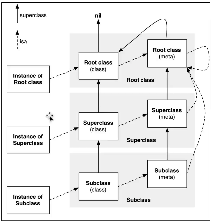

# OC对象的分类

OC对象可以分为3种:</br>
　1.instance对象(实例对象)</br>
　2.class对象(类对象)</br>
　3.meta-class对象(元类对象)

### instance对象</br>
* **定义**:就是通过类alloc出来的对象,每次调用alloc都会产生新的instance对象</br>
* **内存中存储的信息:**</br>
　　1.isa指针</br> 
　　2.其他成员变量</br>
>Tip.</br>
>实例对象的内存地址值与isa的地址是相同的

### Class对象</br>
* **定义**:一个类的类对象在内存中是唯一的,即每个类在内存中有且只有一个class对象</br>
* **内存中存储的信息:**</br>
　　1.isa指针</br>
　　2.superclass指针</br>
　　3.类的属性信息(@property),类的对象方法信息(instance method)</br>
　　4.类的协议信息(protocol),类的成员变量信息(ivar)</br>
>Tip.</br>
>1.此处的类的成员变量信息指的是,成员变量的描述信息(类型,变量名等) </br>
2.class的底层实现实际就是调用object_getClass方法

### Meta-Class对象</br>
* **定义**:每个类在内存中有且只有一个meta-class对象</br>
* **内存中存储的信息:**</br>
　　1.isa指针</br>
　　2.superclass指针</br>
　　3.类的类方法信息</br>

>Tip.</br>
>1.获取原类对象方式:将类对象作为参数传入object_getClass方法中 ,即可获得原类对象</br>
2.注:class方法返回的一直是class对象,类对象,故[[NSObject class]class]无论调用多少次class方法,都为类对象</br>
3.meta-class对象和class对象的内存结构是一样的,但是用途不一样,即普通的class对象对应存储的信息(类的属性名等)为NULL,同理,对于类对象而言,类方法信息也为NULL</br>
4.调用class_isMetaClass可以判断是否为原类对象

>比较三个方法:</br>
>**objc_getClass**方法是传入一个字符串,返回对应的类对象,不会返回原类对象</br>
**object_getClass**方法是传入一个对象,根据传入的对象,返回类对象或原类对象,即是拿到isa</br>
**class**方法:返回的就是类对象</br> 

```objc
[person personTest];
//底层上,会将实例方法或对象方法转换成runtime的objc_msgSend方法,personTest,但具体是对象方法还是类方法是不知道的
//实际上即为objc_msgSend(person ,@selector(personTest));
```

实例对象调用**对象方法**,底层就是给实例对象发送一条消息</br>
类对象调用**类方法**,底层就是给类对象发送一条消息

### isa指针</br>
* instance的isa指向class,class的isa指针指向meta-class</br>
* 当调用对象方法时,通过instance的isa找到class,最后找到对象方法的实现进行调用</br>
* 当调用类方法时,通过class的isa找到meta-class,最后找到类方法的实现进行调用</br>

### superclass指针</br>
* 指向父类的类对象,类对象的superclass指向其父类的类对象,原类对象的superclass指向其父类的原类对象</br>
* 若student继承自person,则student调用person中的对象方法,调用流程是:student的isa指针找到student的类对象,通过该类对象的superclass指针找到person的类对象,调用person的对象方法</br>

### isa、superclass总结</br>
　1.instance的isa指向class</br>
　2.class 的isa指向meta-class</br>
　3.meta-class的isa指向基类的meta-class</br>
　4.class的superclass指向父类的class,如果没有父类,superclass指针为nil</br>
　5.meta-class的suerclass指向父类的meta-class，基类的meta-class的superclass指向基类的class</br>
　6.instance调用对象方法的轨迹：isa找到class,方法不存在,就通过superclass找父类,直到superclass为nil为止</br>
　7.class调用类方法的轨迹:isa找到meta-class,方法不存在,就通过superclass找父类,直到superclass为nil为止</br>

>最终调用的方法是不知道对象方法还是类方法的,而是通过方法名,因为oc没有很严格地面向对象,发送消息则是寻找isa,再一级一级往上寻找



superclass内是直接存储父类的地址值,而isa中的指针需要&一个MASK值才能得到类对象的地址值


>若为.m文件,则只能认识oc及c语言,而改成mm文件,则都能识别

### 一些问题总结</br>
Q1.对象的isa指针指向哪里?</br>
* instance对象的isa指向class对象</br>
* class对象的isa指向meta-class对象</br>
* meta-class对象的isa指向基类的meta-class对象

Q2.OC的类信息存放在哪里>
* 对象方法、属性、成员变量、协议信息存放在class对象中</br>
* 类方法存放在meta-class对象中</br>
* 成员变量的具体值,存放在instance对象</br>

>类与元类对象在程序一开始时就会加载进内存中,当需要使用时,调用load方法使用