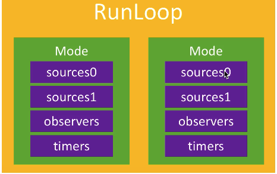
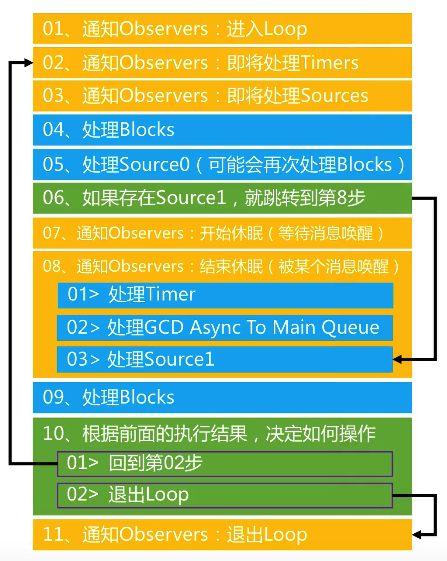

# Runloop

Runloop作用:</br>
* 保持程序的持续运行
* 处理程序的各种事件(触摸事件、定时器事件等)
* 节约CPU资源,提高程序性能

程序中Main函数中的UIApplicationMain函数主要作用就是创建了一个主运行循环

Runloop有两种形式:</br>
* OC语言-- NSRunloop
* C语言 -- CFRunloopRef

### Runloop与线程的关系:</br>
* 每一条线程都有一个与之对应的runloop对象
* runloop保存在全局的字典内,是以线程为key,runloop为value
* 线程刚创建时没有runloop对象的,runloop会在第一次获取他的时候创建
* runloop在线程销毁时销毁

### Runloop与Mode的关系:</br>


Runloop只能选择其中一个mode,称之为CurrentMode</br>
如果需要切换mode,只能退出当前mode,重新选择一个Mode进入</br>
不同组的source0,source1,observers,timer能分隔开,互不影响

>注:如果mode里没有任何source0等等的事件,则runloop会立马退出</br>
>切换mode也是在Runloop内部,不会导致程序退出

常见的2种Mode:</br>
* kCFRunloopDefaultMode  //程序的默认Mode
* UITrackingRunloopMode  //界面追踪Mode

>注:kCFRunloopCommonModes默认包括了kCFRunloopDefaultMode和UITrackingRunloopMode
>kCFRunloopCommonModes并不是一个真正的模式,只是一个标记,而kCFRunloopDefaultMode和UITrackingRunloopMode的模式是真正意义的模式,timer在设置了kCFRunloopCommonModes标记的模式下都能运行,而kCFRunloopDefaultMode和UITrackingRunloopMode这两个模式都是kCFRunloopCommonModes标记的,

使用NSRunloop方式和CFRunloopRef的方式获取两者,会发现地址不一致,实际是NSRunloop是对CFRunloopRef的一层封装,其本质地址还是CFRunLoopRef的地址

>注:(lldb)bt可以获取函数调用栈

Mode中各个成员的含义:</br>
* source0:</br>
1.触摸事件</br>
2.`performSelector :OnThread`

* source1</br>
1.基于Port的线程间通信</br>
2.系统事件的捕捉

* Timer</br>
1.NSTimer</br>
2.`performSelector :afterDelay`

* Observers</br>
1.监听runloop的状态</br>
2.UI刷新(在runloop休眠之前)</br>
3.自动释放池(在runloop休眠之前)

### Runloop运行逻辑:</br>



runloop处理事件一般都是调用`_CFRUNLOOP_IS_CALLING_OUT_TO_XXXX`函数进行事件处理

GCD中当仅在子线程做事情时,是不依赖Runloop的,但当需要回到主线程等线程间操作的时候,需要runloop来执行

线程休眠其实和线程阻塞类似,但和通过代码例如while(1)令线程阻塞是不一样的,使用代码while(1),线程并未休眠,而是不断进行while(1)判断,汇编也并未停止,而线程休眠是可以真正意义上做到令线程不做任何的事情

runloop**休眠**的实现原理: 会从用户态切换到内核的内核态,在内核态执行休眠的目的,是可以实现真正意义上的休眠(即没有消息就是休眠,有消息就唤醒,并回到用户态)

runloop响应用户操作具体流程:先通过source1事件进行捕捉,然后再source0事件进行处理

### Runloop在实际开发中的应用:</br>
* 线程保活
* 解决NSTimer在滑动中停止工作的问题
* 监控应用卡顿
* 性能优化

* 解决NSTimer在滑动中停止工作的问题:</br>
timer是在默认模式下工作的,所以在滑动中(uitracking)的模式下是会停止工作的

```objc
NSTimer *timer = [NSTimer scheduledTimerWithTimeInterval:1 
                                                 repeats:YES          
                                                 block:^(NSTimer * _Nonnull timer) {
            
        }
        
//带有schedule的是会将定时器直接添加到默认的模式

NSTimer *timer = [NSTimer timerWithTimeInterval:1 repeats:YES block:^(NSTimer * _Nonnull timer) {
            
        }]
//该方法不会添加到默认模式去,只会单纯创建一个timer
//后续需要手动调用runloop的addtimer方法才能令定时器工作
```

* 线程保活

runloop的run方法是一个无线的循环,故外部停止runloop只是停止其中一次循环,故是无法停止runloop的,run方法用于开启一个永不销毁的线程

使用runMode方法在唤醒后,做完对应事情,runloop就会退出

performSelector方法的waitUntilDone设置为YES,代表该语句执行完后才会执行后面的语句,设置为NO,则后面语句与该语句是一起执行的

GCD只负责创建线程,不负责线程保活

### 一个问题:</br>
Q:保住线程的命为什么要用runloop,用强指针不就好了?</br>
A:准确的说,使用runloop是为了让线程保持激活状态,线程的任务一旦执行完毕,生命周期就结束,无法再使用