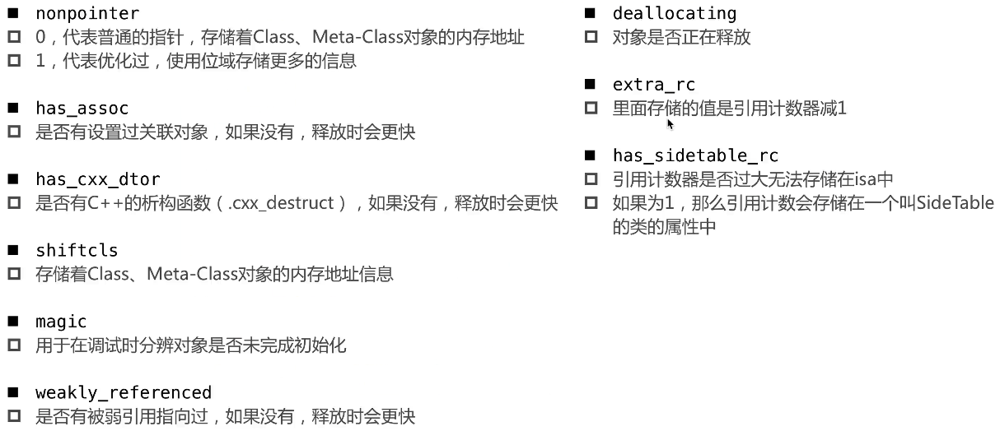
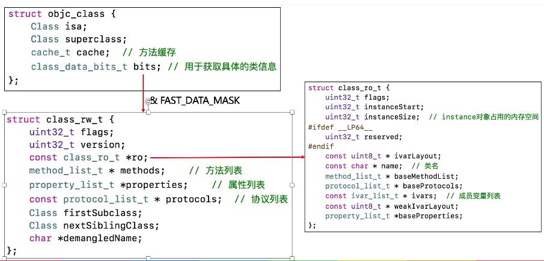
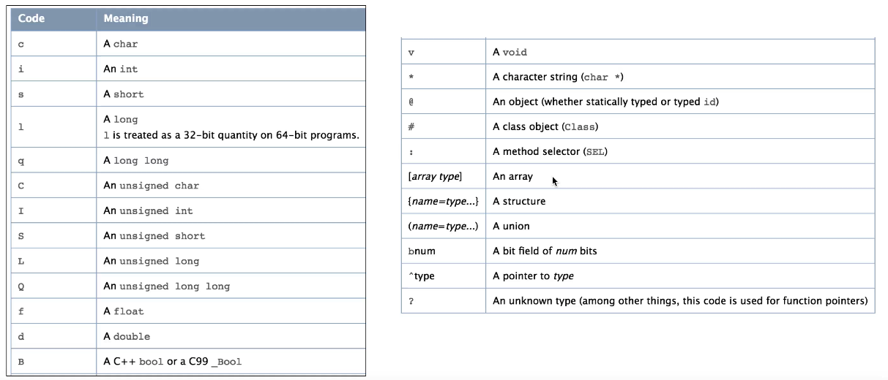
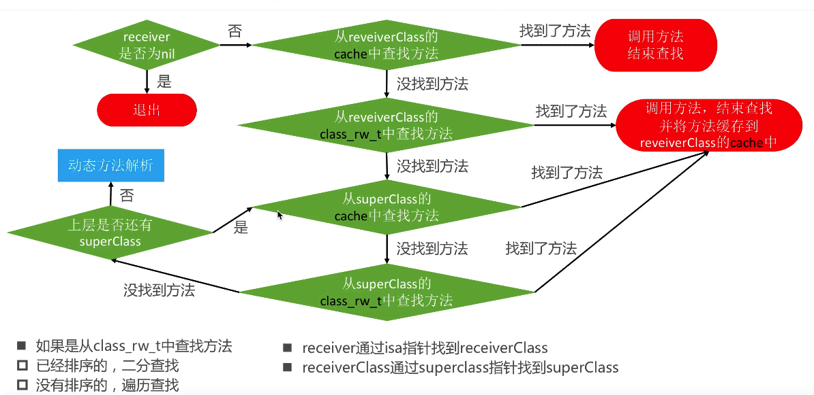
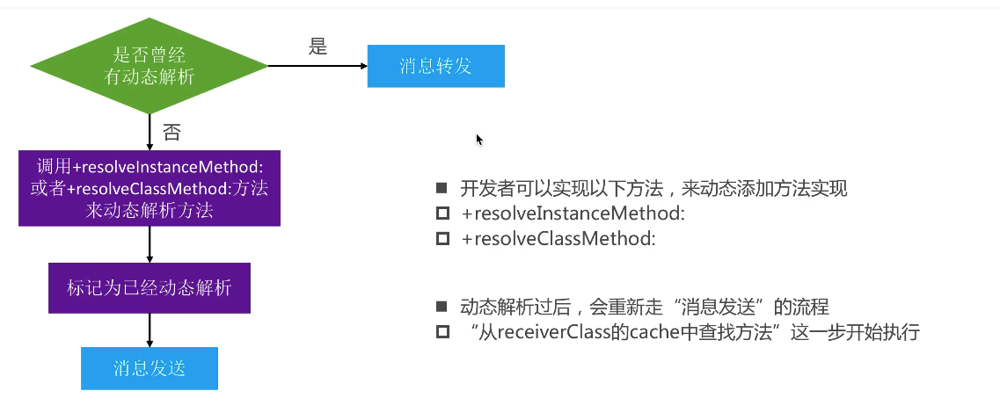
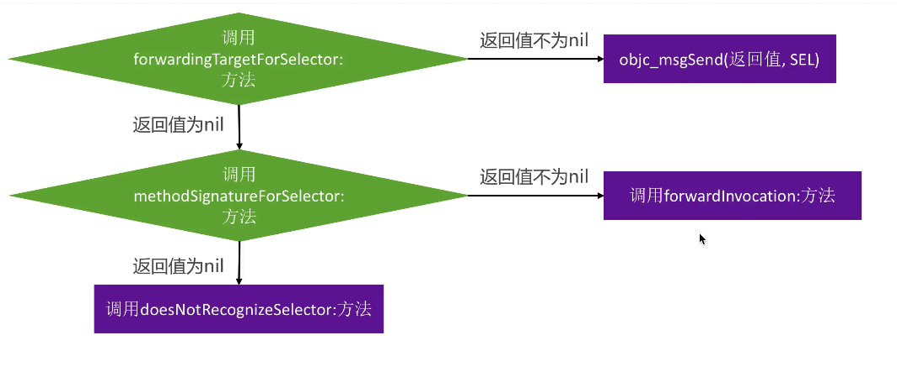

# Runtime

Runtime:运行时,提供了一套C语言的api来支撑OC的动态性

### isa内部结构</br>
* 在arm64架构之前,isa就是一个普通指针,存储着类对象或原类对象的内存地址</br>
* 在arm64架构开始,对isa进行了优化,变成了一个共用体(union)结构,还使用位域来存储更多的信息,即内部结构如下

```objc
union isa_t 
{
    Class cls;
    uintptr_t bits;
    struct {
        uintptr_t nonpointer        : 1;
        uintptr_t has_assoc         : 1;
        uintptr_t has_cxx_dtor      : 1;
        uintptr_t shiftcls          : 33; 
        uintptr_t magic             : 6;
        uintptr_t weakly_referenced : 1;
        uintptr_t deallocating      : 1;
        uintptr_t has_sidetable_rc  : 1;
        uintptr_t extra_rc          : 19;
    };
};
```

* isa中各位存储的信息</br>


* 由于1个字节有8位,故可以通过位为最基本单位存储许多信息,但掩码的设计必须为特定的取值方式</br>
 `&`掩码 :可以用来取出特定的位</br>
 `!!`可以令一个值转换成bool类型</br>
 `|`掩码 :可以用来输入特定的位为YES</br>
 `&~`掩码 :可以用来输入特定的位为NO</br>
 
* 位域</br>

```objc
struct {
    char tall :1;
    char rich :1;
    char handsome :1;
}_tallRichHandsome;
//结构体内的1即表示位域,与左边的char及时什么类型都无关
```

* 当使用位域来进行取值时,若结果为1,则转换为bool类型会输出-1的结果,是因为bool包含8位,而一位的0b1转换为bool值会被填充为`0b1111 1111`,故结果为-1</br>
解决方案有:</br>
1.输出结果前为!!即可</br>
2.将位域改为2位,即

```objc
struct {
	char tall : 2;
	char rich : 2;
	char hansome : 2;
}
```

>tip.</br>
>结构体是无法直接位运算的</br>
>由于isa指针其中33位放地址值的,且后面3位一定为0</br>
>真机即为arm64,模拟器和mac即为x86_64

* 共用体(union):大家共用一个内存,往共用体中添加一个结构体是不影响的</br>

### Class内部结构</br>
* 原类对象是一种特殊的类对象,只是里面存储的只有类方法


* 类对象调用data()方法,结果相当就是class_rw_t结构体</br>

* class_rw_t里面的methods,properties,protocols是二维数组,是可读可写的,包含了类的初始内容,分类的内容,即类和分类的声明的属性,方法,协议都在里面</br>

* class_ro_t里面的baseMethodList,baseProtocols,baseProperties是一维数组,是只读的,包含了类的初始内容,相当于只装着类声明的属性和方法,协议等初始信息,不包含分类

* 原先的bits原先是指向class_ro_t,后来重新创建了一个class_rw_t,再讲bits指向class_rw_t,class_rw_t里面的class_ro_t又指向原先的class_ro_t

>举例:methods是一个二维数组,里面每个元素是method_list_t,而method_list_t又是一个数组,数组里存放着每个元素是method_t类型元素,另外两个依次类推</br>
ro中的数组为一维数组,里面就是method_t类型,另外两个依次类推</br>
这么设计的好处是:**便于动态的添加方法**

>两者的结合:类一开始声明的属性和方法,协议等初始信息,存储在class_ro_t中对应的baseMethodList,baseProtocols,baseProperties中,在程序运行时,再将分类中的方法,协议等信息重新组合,成class_rw_t对应的二维数组,即class_rw_t中部分信息是从class_ro_t中来的

#### 方法method_t</br>
* 每个方法最终都是一个method_t,method_t是对方法/函数的封装</br>
* 定义:</br>

```objc
struct method_t{
    SEL name; //函数名
    const char *types; //编码(返回值类型、参数类型)
    IMP imp; //指向函数的指针(函数地址)
};
```
* 各参数具体含义:</br>
IMP:代表函数的具体实现(也就是函数的地址)</br>
SEL:代表方法/函数名,一般叫选择器,底层结构和`char*`类似,也就是C语言的字符串,说白了就是一个名字</br>
>1.获取SEL的方式:</br>
>```objc
>SEL sel1 = sel_registerName("test");
>SEL sel2 = @selector(test);
>```
>2.可以通过sel_getName()和NSStringFromSelector()转换成字符串</br>
>3.不同类中相同名字的方法,所对应的方法选择器是相同的,即无论SEL创建多少次,只要SEL的名字相同,该SEL都是相同的

　　Types:编码</br>
　　每个方法例如`-(void)test`,都会默认传递2个参数,即,默认方法就为:`- (void)test:id(self) _cmd:(SEL)_cmd `
即通过断点可知,对于`- (void)test`方法,types的值为`v16@0:8`,其中,`v`代表`void`返回值类型,`@`代表`id`类型,:代表`SEL`参数,第一个数字16表示全部参数占多少个字节,`id`和`SEL`都是指针,故为16字节,`@0`中的0表示从第几个字节开始,`id`类型的参数是从第0个字节开始的,故为0,后面的数字同理

>Type Encoding:</br>
iOS提供了一个叫做@encode的指令,可以将具体的类型表示成字符串编码

>对应的类型的encode值如下图,即@encode(id)结果就为@


#### Class方法缓存</br>
* Class内部结构中有个方法缓存(cache_t),用散列表(哈希表)来缓存曾经调用过的方法,可以提高方法的查找速度(空间换时间)</br>
首次查找方法还是按正常流程查找,当找到后,会将方法缓存到cache中,下次再次调用方法,会先从cache中查找,若有则直接使用

* 方法缓存(cache_t)内部结构</br>
 
```objc
struct cache_t{
    struct bucket_t *_bucket; //散列表
    mask_t _mask; //散列表长度 - 1
    mask_t _occupied; //已经缓存的方法数量
}

//散列表内部结构
struct bucket_t{
    cache_key_t _key; //SEL作为key
    IMP _imp;
}
```
* 散列表查找:第一次将方法放入缓存中时,会将@selector(key)&上上面的_mask,得出在数组中的索引,将其放入.若一开始数组为空,假设直接将其放入中间位置,则之前位置的内容置空,该方法是牺牲了内存空间换效率
* 哈希表的核心,通过一个函数,将key生成一个索引,即f(key) == index
* _mask的值为散列表长度-1,是因为&上的值,永远比_mask来的小.(&逻辑即某个值&_mask,其值也是小于_mask的)
* 若key&mask的地址已经存在,则会直接将结果-1,即若原先的值为4,则会判断索引为3的位置是否有对应方法,有则存入,没有则继续-1操作.若索引为0,则直接将其值变为mask
* 散列表数组当容量不足时会进行扩容,一旦散列表数组扩容,则会将缓存清空,扩容策略是,原先长度乘以2
>若长度为4,当第4个方法即将进入缓存时,由于容量已满,则系统会进行扩容,扩容至8个,然后将刚刚的第4个方法放入,清空其他所有的,故此时当前的占用方法数(occupied)为1
* 方法调用的本质:是通过传入对象和SEL去寻找对应方法并执行,即:[person test]该方法转为c/c++代码,实际是转为`objc_msgSend(person sel_registerName(“test”));`</br>
消息接收者(receiver):person</br>
消息名称:test,故通过SEL作为key去缓存方法是有效率的</br>
* 方法缓存会先从cache中查找方法,若没有,则从方法列表中查找,若找到,则会添加到缓存cache中,若类方法没有,会从父类方法中的cache中查找,若没有,则从父类方法列表查找,依次类推...若存在,则会在自己的类对象cache中缓存一份

#### OC的方法调用</br>
* 消息机制:给方法调用者发送消息
* OC方法调用,其实都是转换为objc_msgSend函数的调用
>`objc_msgSend`的执行流程可以分为3大阶段</br>
1)消息发送:即将消息发送给消息接收者,调用对应方法</br>
2)动态方法解析</br>
3)消息转发</br>
`objc_msgSend`如果找不到合适的方法进行调用,会报错`unrecogized selector sent to instance`的错误

>p.s 1.C语言的函数,在汇编中在方法名前会多出一个下划线”_ ”
>  2.在调试时输入指令 `p(IMP)地址值 ` 能查看该地址是否为对应的方法

* 消息发送流程:


* 动态方法解析:</br>
1)判断SEL,调用class_addMethod()方法

```objc
struct method_t {
    SEL sel;
    char *types;
    IMP imp;
};

//该方法会直接将方法添加到类对象的class_rw_t中,即methods中
+ (BOOL)resolveInstanceMethod:(SEL)sel {
    if (sel == @selector(test)) {
        //通过class_getInstanceMethod方法获取其他方法,该方法的类型为Method,内部实际为struct objc_method *,其等价于struct method_t
        struct method_t *method = (struct method_t *)class_getInstanceMethod(self, @selector(other));
        
        //Method method =  class_getInstanceMethod(self, @selector(other));
        //动态添加方法,但在开发中并不常用
        class_addMethod(self, sel, method->imp, method->types);
        return YES;//建议都返回YES,虽然返回NO也能成功
    }
    return [super resolveInstanceMethod:sel];
}
```


* 消息转发: 将消息转发给别人</br>


```objc
//会先调用下面的方法查找有无实现,若实现,则直接将消息转发给return返回的对象
- (id)forwardingTargetForSelector:(SEL)aSelector {
    if (aSelector == @selector(test:)) {
        return [[MXCat alloc]init];
    }
    return [super forwardingTargetForSelector:aSelector];
}
```

```objc
//若没有实现forwardingTargetForSelector:(SEL)aSelector方法,则会进入方法签名阶段
//方法签名:返回值类型、参数类型
//若方法签名返回空,则不会来到forwardInvocation方法了
- (NSMethodSignature *)methodSignatureForSelector:(SEL)aSelector {
    if (aSelector == @selector(test:)) {
    
        //返回的方法签名决定了invocation的包装的参数和返回值等信息
        //参数的顺序:receiver、selector、other arguments
        return [NSMethodSignature signatureWithObjCTypes:"i@:i"];
        
        //方法签名也可以由已实现方法的对象/类进行生成,即若MJCat对象也同样实现了对应的方法,可以使用MJCat对象生成对应方法签名
        //return [[[MJCat alloc]init] signatureWithObjCTypes:"i@:i"];
    }
    return [super methodSignatureForSelector:aSelector];
}

//NSIvocation封装了一个方法调用,包括:方法调用者(invocation.target)、方法(invocation.selector)、方法参数(invocation getArgument方法);
//调用方法最终实现实际上是在forwardInvocation方法中
- (void)forwardInvocation:(NSInvocation *)anInvocation {

    //invoke方法可以令target对象调用对应的方法
    [anInvocation invokeWithTarget:[[MXCat alloc]init]];
    
    int age;
    [anInvocation getReturnValue:&age];
    
    NSLog(@"%d",age);
}
```
* 若是类对象,对应的forwardingTargetForSelector,重签名方法,forwardInvocation方法应该改为+方法,因为从源码可知,这几个方法的调用者为消息接收者
* forwardingTargetForSelector方法的本质就是objc_msgSend方法,故方法调用只关注消息接收者和SEL,与是否为对象方法还是类方法没有关系

#### @dynamic相关内容</br>
* 声明属性会帮忙生成get方法和set方法,以及带下划线的成员变量,同时还有set和get方法的实现,至于会自动生成set和get的实现,同时会出现@sycthesize关键字

```objc
@sycthesize age= _age, height = _height;
//意义是:为age属性自动生成一个_age的成员变量,及get和set方法的实现
//后面的版本xcode已经自动帮忙完成
```
* @dynamic会提醒编译器不自动生成get和set方法的实现, 不要自动生成成员变量
* @sycthesize和@dynamic均不影响set和get的声明

* 
* 