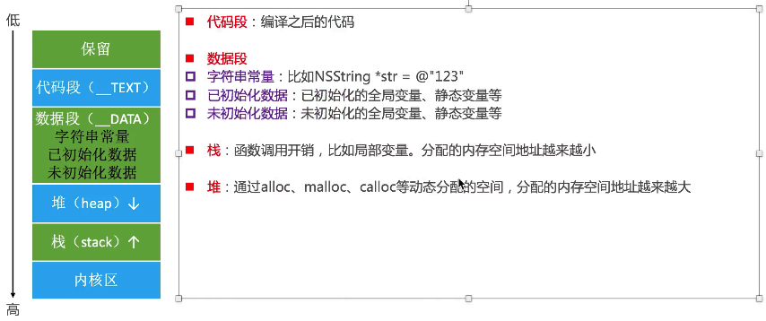

# 内存管理

### CADisplayLink、NSTimer使用注意点:</br>
1.CADisplayLink、NSTimer会对target产生强引用,如果target又对他们产生强引用,就会产生循环引用</br>
2.这两个定时器存在不准时的可能性

* 解决循环引用的问题

解决方案1:消息转发机制+中间对象进行处理
```objc
//MXTestProxy:NSObject
+ (instancetype)proxyWithTarget:(id)target {
    MXTestProxy *pro = [[MXTestProxy alloc]init];
    pro.target = target;
    return pro;
    
}

- (id)forwardingTargetForSelector:(SEL)aSelector {
    return self.target;
}


//CADisplayLink
self.link = [CADisplayLink displayLinkWithTarget:[MXTestProxy proxyWithTarget:self] selector:@selector(test)];
[self.link addToRunLoop:[NSRunLoop currentRunLoop] forMode:NSDefaultRunLoopMode];

//注:CADisplayLink无需设置时间,因为其保证调用频率和屏幕的刷帧频率一致,60FTP(1秒调用60次).
```

由此,可以使用系统内部的NSProxy类,NSProxy本来就是用于设计消息转发的

```objc
//MXProxy : NSProxy
+ (instancetype)proxyWithTarget:(id)target {
 
    //NSProxy对象不需要调用init,因为它根本没有init方法,只需要调用alloc即可
    MXProxy *proxy = [MXProxy alloc];
    proxy.target = target;
    return proxy;
}

- (NSMethodSignature *)methodSignatureForSelector:(SEL)sel {
    return [self.target methodSignatureForSelector:sel];
}

- (void)forwardInvocation:(NSInvocation *)invocation {
    [invocation invokeWithTarget:self.target];
}

//CADisplayLink
self.link = [CADisplayLink displayLinkWithTarget:[MXProxy proxyWithTarget:self] selector:@selector(test)];
[self.link addToRunLoop:[NSRunLoop mainRunLoop] forMode:NSDefaultRunLoopMode];
```

* 继承自NSObject,方法调用流程:即原先消息机制的3个部分
* 继承自NSProxy,直接就进入消息转发,但其并没有`- (id)forwardingTargetForSelector:(SEL)aSelector`方法

```objc
MXProxy *pro = [MXProxy proxyWithTarget:self];
NSLog(@"%d",[pro isKindOfClass:[UIViewController class]]);
//该运行结果为1
```

以上结果为1,是因为若是继承自NSProxy的对象调用对应的NSObject的方法,由于其内部就是消息转发,故会令消息转发者发送对应消息,即假设proxy是继承自NSProxy,则[proxy isKindOfClass]方法的实际调用者还是消息转发者,而不是proxy

解决方案2:定义NSTimer使用block方法创建

```objc
__weak typeof(self)weakSelf = self;
self.timer = [NSTimer timerWithTimeInterval:1.0 repeats:YES block:^(NSTimer * _Nonnull timer) {
        [weakSelf test];
    }];
[[NSRunLoop currentRunLoop]addTimer:self.timer forMode:NSRunLoopCommonModes];
```

若向原先的方式使用weakSelf,即往target中传入weakSelf会失败,因为这个是对block才有效,因为block特性是若外部变量使用的是弱指针进行引用,则block会对该变量有一个弱引用,同理,若是强指针进行引用,则block会对该变量有一个强引用.故传入弱指针解决循环引用只对block有效,定时器中传入的target,由于外部只是将参数地址传入,后赋值给timer内部对应的成员变量,故传入的是强指针还是弱指针是没有效果的

* 解决定时器不准的问题

原因:CADisplayLink和NSTimer底层都是由runloop实现的,是依赖于runloop的,如果runloop的任务过于繁重,可能导致这两个定时器不准时

>即假设定时器设置每隔1s调用一次方法,则runloop会每跑一次圈,就计算下时间,若没达到1s,则继续跑圈,当达到1s,就处理定时器任务但runloop的跑圈时间是不固定的,故会导致定时器时间不准时

由于GCD的定时器是直接与系统内核挂钩的,与runloop无关,故无论外部的runloop发生怎样的操作,都不会影响GCD定时器的运行

```objc
dispatch_queue_t queue = dispatch_get_main_queue();
    
dispatch_source_t timer = dispatch_source_create(DISPATCH_SOURCE_TYPE_TIMER, 0, 0, queue);

dispatch_source_set_timer(timer, DISPATCH_TIME_NOW, 1 * NSEC_PER_SEC, 0 * NSEC_PER_SEC);
//第二个参数:从什么时候开始,若需要延迟执行,则传入dispatch_time(DISPATCH_TIME_NOW, 延迟的秒数 * NSEC_PER_SEC)
//第三个参数:每个几秒执行
//第四个参数:传入0即可

dispatch_source_set_event_handler(timer, ^{
        NSLog(@"123");
    });
dispatch_resume(timer);
```

>注:GCD创建的对象在ARC环境中都不需要我们去管理内存

### 内存布局:</br>

* 堆区的地址是从小到大分配的,且内存地址(十六进制)的第一位一定是0.因为内存对齐(最小单位为16)
* 栈区的地址是从大到小分配的