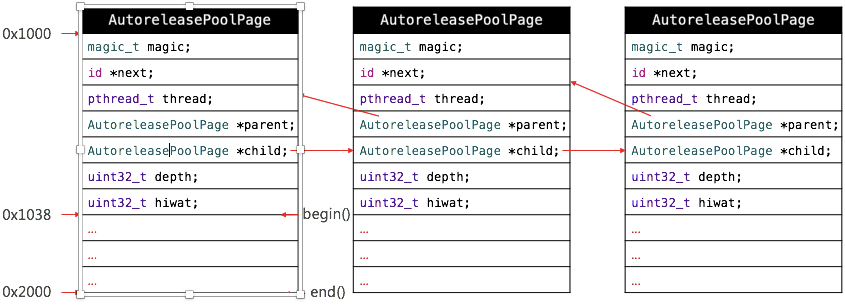

# 内存管理

### CADisplayLink、NSTimer使用注意点:</br>
1.CADisplayLink、NSTimer会对target产生强引用,如果target又对他们产生强引用,就会产生循环引用</br>
2.这两个定时器存在不准时的可能性

* 解决循环引用的问题

解决方案1:消息转发机制+中间对象进行处理
```objc
//MXTestProxy:NSObject
+ (instancetype)proxyWithTarget:(id)target {
    MXTestProxy *pro = [[MXTestProxy alloc]init];
    pro.target = target;
    return pro;
    
}

- (id)forwardingTargetForSelector:(SEL)aSelector {
    return self.target;
}


//CADisplayLink
self.link = [CADisplayLink displayLinkWithTarget:[MXTestProxy proxyWithTarget:self] selector:@selector(test)];
[self.link addToRunLoop:[NSRunLoop currentRunLoop] forMode:NSDefaultRunLoopMode];

//注:CADisplayLink无需设置时间,因为其保证调用频率和屏幕的刷帧频率一致,60FTP(1秒调用60次).
```

由此,可以使用系统内部的NSProxy类,NSProxy本来就是用于设计消息转发的

```objc
//MXProxy : NSProxy
+ (instancetype)proxyWithTarget:(id)target {
 
    //NSProxy对象不需要调用init,因为它根本没有init方法,只需要调用alloc即可
    MXProxy *proxy = [MXProxy alloc];
    proxy.target = target;
    return proxy;
}

- (NSMethodSignature *)methodSignatureForSelector:(SEL)sel {
    return [self.target methodSignatureForSelector:sel];
}

- (void)forwardInvocation:(NSInvocation *)invocation {
    [invocation invokeWithTarget:self.target];
}

//CADisplayLink
self.link = [CADisplayLink displayLinkWithTarget:[MXProxy proxyWithTarget:self] selector:@selector(test)];
[self.link addToRunLoop:[NSRunLoop mainRunLoop] forMode:NSDefaultRunLoopMode];
```

* 继承自NSObject,方法调用流程:即原先消息机制的3个部分
* 继承自NSProxy,直接就进入消息转发,但其并没有`- (id)forwardingTargetForSelector:(SEL)aSelector`方法

```objc
MXProxy *pro = [MXProxy proxyWithTarget:self];
NSLog(@"%d",[pro isKindOfClass:[UIViewController class]]);
//该运行结果为1
```

以上结果为1,是因为若是继承自NSProxy的对象调用对应的NSObject的方法,由于其内部就是消息转发,故会令消息转发者发送对应消息,即假设proxy是继承自NSProxy,则[proxy isKindOfClass]方法的实际调用者还是消息转发者,而不是proxy

解决方案2:定义NSTimer使用block方法创建

```objc
__weak typeof(self)weakSelf = self;
self.timer = [NSTimer timerWithTimeInterval:1.0 repeats:YES block:^(NSTimer * _Nonnull timer) {
        [weakSelf test];
    }];
[[NSRunLoop currentRunLoop]addTimer:self.timer forMode:NSRunLoopCommonModes];
```

若向原先的方式使用weakSelf,即往target中传入weakSelf会失败,因为这个是对block才有效,因为block特性是若外部变量使用的是弱指针进行引用,则block会对该变量有一个弱引用,同理,若是强指针进行引用,则block会对该变量有一个强引用.故传入弱指针解决循环引用只对block有效,定时器中传入的target,由于外部只是将参数地址传入,后赋值给timer内部对应的成员变量,故传入的是强指针还是弱指针是没有效果的

* 解决定时器不准的问题

原因:CADisplayLink和NSTimer底层都是由runloop实现的,是依赖于runloop的,如果runloop的任务过于繁重,可能导致这两个定时器不准时

>即假设定时器设置每隔1s调用一次方法,则runloop会每跑一次圈,就计算下时间,若没达到1s,则继续跑圈,当达到1s,就处理定时器任务但runloop的跑圈时间是不固定的,故会导致定时器时间不准时

由于GCD的定时器是直接与系统内核挂钩的,与runloop无关,故无论外部的runloop发生怎样的操作,都不会影响GCD定时器的运行

```objc
dispatch_queue_t queue = dispatch_get_main_queue();
    
dispatch_source_t timer = dispatch_source_create(DISPATCH_SOURCE_TYPE_TIMER, 0, 0, queue);

dispatch_source_set_timer(timer, DISPATCH_TIME_NOW, 1 * NSEC_PER_SEC, 0 * NSEC_PER_SEC);
//第二个参数:从什么时候开始,若需要延迟执行,则传入dispatch_time(DISPATCH_TIME_NOW, 延迟的秒数 * NSEC_PER_SEC)
//第三个参数:每个几秒执行
//第四个参数:传入0即可

dispatch_source_set_event_handler(timer, ^{
        NSLog(@"123");
    });
dispatch_resume(timer);
```

>注:GCD创建的对象在ARC环境中都不需要我们去管理内存

### 内存布局:</br>

* 堆区的地址是从小到大分配的,且内存地址(十六进制)的最低位一定是0.因为内存对齐(最小单位为16)
* 栈区的地址是从大到小分配的

### Tagged Pointer:</br>
* 从64bit开始,iOS引入了tagged pointer技术,用于优化NSNumber、NSDate、NSString等小对象的存储
* 在没有使用tagged pointer之前,NSNumber等对象需要动态分配内存,维护引用计数等,NSNumber指针存储的是堆中NSNumber对象的地址值
* 使用tagged pointer之后,NSNumber指针里存储的数据变成了Tag+ Data,也就是将数据存储在了指针中
* 当指针不够存储数据时,才会使用动态分配内存的方式来存储数据
* objc_msgSend能识别tagged pointer,直接从指针提取数据,节省了以前的调用开销

一道面试题:
```objc
@property (strong, nonatomic) NSString *name;

dispatch_queue_t queue = dispatch_get_global_queue(0, 0);
    
    for (int i = 0; i<100; i++) {
        dispatch_async(queue, ^{
            self.name = [NSString stringWithFormat:@"123hjgjhgjhgjg" ];
        });
    }
//运行结果崩溃,会报坏内存访问
```
原因:for循环中实际是频繁调用setter方法,而ARC环境中的setter方法实际会转换为MRC中对应的代码内容

```objc
- (void)setName:(NSString *)name {
    if (_name != name) {
        [_name release];
        [name retain];
    }
}
```
当其他线程同时执行setter方法时,可能存在当name属性已经release,但其他线程继续调用release,导致其坏内存访问

>其中,如上的代码策略对应的不同,即strong对应retain,copy对应copy

但上述面试题中,若self.name的字符串为tagged pointer时.不会报错,是因为tagged pointer本身就不是OC对象,是指针的赋值,不存在调用setter和getter进行赋值

* 如何判断一个指针是否为Tagged Pointer？</br>
iOS平台，最高有效位是1（第64bit）,其中需要保证其有64位,即0x后面的数字须有16位</br>
Mac平台，最低有效位是1

### MRC:</br>
* 在iOS中，使用引用计数来管理OC对象的内存
* 一个新创建的OC对象引用计数默认是1，当引用计数减为0，OC对象就会销毁，释放其占用的内存空间
* 调用retain会让OC对象的引用计数+1，调用release会让OC对象的引用计数-1

在进行setter操作时,会先进行判断是否为同一对象,若为同一对象,则不会做任何事情,若为不同对象,则需要先释放之前的对象,在retain新的对象</br>
* 若是使用retain修饰,则setter会执行上面的代码
* 若是使用assign修饰,则setter只会进行单纯的赋值操作

```objc
//MRC中setter方法写法
- (void)setName:(NSString *)name {
    if (_name != name) {
        [_name release];
        [name retain];
    }
}

//dealloc方法
- (void)dealloc {
    [_name release];
    _name = nil;
    
    //也可以用下面这一句代替上面两句,这两句是等价的
    //self.name = nil;
    
    //在dealloc方法中,父类的dealloc方法放在最后执行
    [super dealloc]
}
//在换属性时/自己挂掉时,要记得release操作
```

在MRC中,若使用retain关键词,系统会自动生成上述的setter和getter,但dealloc中还是需要自己完成,即释放还是需要自己去完成

内存管理的经验总结:</br>
* 当调用alloc、new、copy、mutableCopy方法返回了一个对象，在不需要这个对象时，要调用release或者autorelease来释放它
* 想拥有某个对象，就让它的引用计数+1；不想再拥有某个对象，就让它的引用计数-1
* 通过类方法创建的对象,在系统内部已经自动帮忙调用release,即除了alloc、copy、new方法创建对象,需要调用release,其余是不需要release的

>使用MRC进行开发
```objc
self.dataArr =  [[[NSMutableArray alloc]init]autorelease];
//含义是:NSMutableArray *dataArr = [[NSMutableArray alloc]init];
	    self.dataArr = dataArr;
	    [dataArr release];
 故在dealloc方法中,还需要调用self.dataArr = nil;
```

### Copy:</br>
* 拷贝的目的:产生一个副本对象,跟原对象互不影响</br>
修改了原对象不会影响副本对象</br>
修改了副本对象,不会影响原对象</br>

* iOS提供了两个拷贝方法:</br>
1.copy:不可变拷贝,产生不可变副本</br>
2.mutableCopy:可变拷贝,产生可变副本</br>

若两个对象(str1和str2)都为不可变字符串,即NSString,若str1 = [str2 copy],会发现str1和str2的内存地址是相同的</br>
原因:由于拷贝的目的是,产生一个副本对象,跟原对象互不影响</br>
且str1是一个不可变字符串,本身就没法修改内容,故可以直接令拷贝出来的字符串对象也指向原先相同的字符串对象

* 深拷贝和浅拷贝:</br>
1.深拷贝:内容拷贝,产生新的对象</br>
2,浅拷贝:指针拷贝,没有产生新的对象(拷贝的内容没有拷贝)</br>


>注意点:</br>
>1.当策略写的是copy,属性不要写不可变类型</br>
基本上有关文字的,使用copy修饰,对于字典和数组,还是使用strong来的多</br>
>2.属性的修饰也一定是copy,不存在mutableCopy,因为mutableCopy只存在于NSString等foundation框架的部分类</br>
>3.自定义对象只需管好copy即可</br>
>4.自定义类需要实现copy操作,需要手动实现copyWithZone方法

### 引用计数的存储:</br>
在64位系统中,引用计数可以直接存储在优化过的isa指针中,若引用计数过大,则isa中has_sidetable_rc的值为1,并且引用计数会存储在Side Table类中

```objc
//Side Table结构体定义:
struct SideTable {
    spinlock_t slock;
    RefcountMap refcnts; //是一个存放对象引用计数的散列表
    weak_table_t weak_table;
}
```

`__strong`: 强引用指针</br>
`__weak`: 弱指针,当所指内容不存在时,指针会自动变为nil</br>
`__unsafe_unretained` :也不会产生强引用,但当指针所指的内容不存在时,会报野指针错误</br>

### 几道面试题:</br>
1.weak指针的实现原理:</br>
将弱引用存储到一张哈希表中,对象要销毁时,会取出当前对象对应的弱引用表,把弱引用表中的内容给清除掉(runtime)

2.ARC帮助我们做了什么?</br>
ARC即LLVM+runtime的结果</br>
ARC通过LLVM编译器,自动生成retain,release,autorelease代码,弱引用这样的存在,是通过runtime在对象销毁时,自动将弱引用清空掉


### 自动释放池:</br>
使用release方法,会导致在release代码后,若继续使用被销毁的对象,则会报坏内存访问错误,若使用autorelease,则无需关心这个问题

从源码可以看出,@autoreleasepool通过转换为c++代码,即开头是一个构造函数:objc_autoreleasePoolPush()函数,结尾是一个析构函数:
objc_autoreleasePoolPop()函数

自动释放池的主要底层数据结构是：`__AtAutoreleasePool`、`AutoreleasePoolPage`</br>
`__AtAutoreleasePool`是一个结构体,内部包含了构造函数:objc_autoreleasePoolPush()和析构函数:
objc_autoreleasePoolPop(),而push和pop两个函数都是与AutoreleasePoolPage相关

调用了autorelease的对象最终都是通过AutoreleasePoolPage对象来管理的</br>
1)每个AutoreleasePoolPage对象占用4096字节内存，除了用来存放它内部的成员变量，剩下的空间用来存放autorelease对象(即调用autorelease方法的对象)的地址</br>
2)所有的AutoreleasePoolPage对象通过双向链表的形式连接在一起



> * 其中begin()中即为起始指针的地址(0X1000)加上指针自身大小(56字节)
end()即为起始指针的地址(0X1000)加上AutoreleasePoolPage(4096字节)大小</br>
> *  begin和end之间才是存放autorelease对象的,其余是存放AutoreleasePoolPage原先的一些成员变量的
> *  调用push方法会将一个POOL_BOUNDARY入栈，并且返回其存放的内存地址
> *  调用pop方法时传入一个POOL_BOUNDARY的内存地址，会从最后一个入栈的对象开始发送release消息，直到遇到这个POOL_BOUNDARY
> *  `id *next`指向了下一个能存放autorelease对象地址的区域  
> *  可以通过以下私有函数来查看自动释放池的情况:`extern void _objc_autoreleasePoolPrint(void);`
