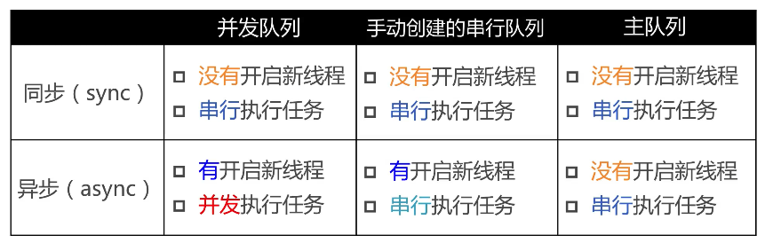

# 多线程

### 多线程相关知识: 
**同步线程**:dispatch中的sync函数,即是在当前线程做事情

**异步函数**:dispatch中的async函数,即在另外一条线程做事情

**并发队列**:允许多个任务同时执行
可以让多个任务并发(同时)执行(自动开启多个线程同时执行任务) 
并发功能只有在异步函数(dispatch_async)下才有效

**串行队列**:让任务一个接一个地执行(执行完一个再执行下一个)

>注:通过CF开头的函数创建出来的变量,需要手动调用CFRealease去释放,但GCD的是不用的

**同步**与**异步**:能否开启新线程 (决定了是在哪个线程执行) 
* **同步**:在当前线程中执行任务.不具备开启新线程的能力
* **异步**:在新的线程中执行任务,具备开启新线程的能力
* **同步函数**:立马在当前线程执行任务,执行完毕后才能继续往下执行,即同步函数内的任务不执行完,该函数就会卡住,不会继续往下执行
* **异步函数**:不要求立马在当前线程执行任务,会等上一个任务执行完再执行

**并发和串行**:任务的执行方式 
* **并发**:多个任务并发(同时)执行
* **串行**:一个任务执行完成后,再执行下一个任务

**主队列**是一种特殊的串行队列 
只要是放到主队列的任务,都是在主线程执行

### 死锁: 
队列的特点:FIFO(First In First Out)先进先出

产生死锁的两个情况: 
* 当同步函数内的队列是主队列时,会产生死锁
* 使用sync函数往当前串行队列中添加任务,就会产生死锁

